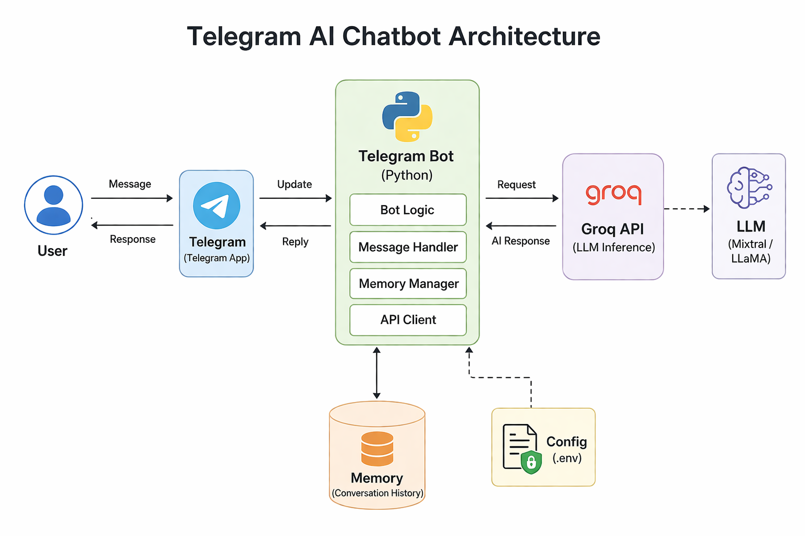

# 🤖 Telegram-AI-Chatbot-using-Groq-API-Fast-LLM-Memory-Support-
Built a lightning-fast AI Telegram chatbot using Groq API 🚀 Features smart responses, memory support, and seamless Telegram integration. Designed for real-world AI applications like assistants, support bots, and automation. Clean, scalable, and ready to deploy.

---

## 🚀 Features

* 🤖 AI-powered chatbot using Groq API
* 💬 Telegram bot integration
* 🧠 Conversation memory support
* ⚡ Fast responses (Groq LLMs)
* 🔐 Secure API key handling with `.env`

---

## 🛠️ Tech Stack

* Python
* python-telegram-bot
* Groq API
* dotenv
---

## 🏗️ System Architecture



### Flow Explanation

1. User sends message via Telegram  
2. Telegram Bot API forwards request to Python Bot  
3. Bot processes input and retrieves conversation memory  
4. Request sent to Groq API (LLM)  
5. AI generates response  
6. Response sent back to user via Telegram 
---

## 📁 Project Structure

```
Telegram-AI-Chatbot-using-Groq-API-Fast-LLM-Memory-Support-/
│
├── app.py
├── config.py
├── llm.py
├── memory.py
├── requirements.txt
├── .env.example
└── README.md
├── assets/
│   └── architecture.png
```

---

## ⚙️ Setup Instructions

### 1️⃣ Clone Repository

```
git clone https://github.com/vivekpatil03/Telegram-AI-Chatbot-using-Groq-API-Fast-LLM-Memory-Support-.git
cd Telegram-AI-Chatbot-using-Groq-API-Fast-LLM-Memory-Support-
```

---

### 2️⃣ Create Virtual Environment

```
python -m venv venv
```

Activate:

* Windows:

```
venv\Scripts\activate
```

* Mac/Linux:

```
source venv/bin/activate
```

---

### 3️⃣ Install Dependencies

```
pip install -r requirements.txt
```

---

### 4️⃣ Setup Environment Variables

Create `.env` file:

```
TELEGRAM_BOT_TOKEN=your_token_here
GROQ_API_KEY=your_groq_api_key_here
```

---

## 🔑 How to Get API Keys

### Telegram Bot Token

1. Open Telegram
2. Search **BotFather**
3. Run:

```
/start
/newbot
```

4. Copy your token

---

### Groq API Key (FREE)

1. Go to: https://console.groq.com/
2. Create account
3. Generate API key

---

## ▶️ Run the Bot

```
python app.py
```

---

## 💬 How It Works

1. User sends message on Telegram
2. Bot receives message
3. Message sent to Groq LLM
4. Response generated
5. Reply sent back to user
6. Memory stored (optional)

---

## 🧠 Example Use Cases

* AI Assistant
* Customer Support Bot
* Learning Assistant
* Personal Chatbot

---

## 👨‍💻 Author

Built by **Vivek Patil**

---

## ⭐ Support

If you like this project:

⭐ Star this repo
🔁 Share on LinkedIn
💬 Connect with me

---
